# 🛡️ ApiSentinel

<div align="center">

[](https://golang.org)
[](https://nextjs.org)
[](https://grpc.io)
[](https://www.postgresql.org)
[](https://valkey.io)
[](https://www.docker.com)
[](LICENSE)

**Geliştirici Odaklı Shift-Left API Güvenliği, Webhook Gözlemlenebilirliği ve Entegrasyon Dayanıklılık Platformu**

[Özellikler](#-temel-özellikler) • [Mimari Şemaları](#-sistem-mimarisi--diyagramlar) • [Görsel Arayüz Turu](#-görsel-arayüz-turu--ekran-görüntüleri) • [Hızlı Başlangıç](#-hızlı-başlangıç) • [CLI Ajanı](#-shift-left-cli-ajanı-apisentinel) • [API Referansı](#-api-rotaları-ve-sözleşmeler)

</div>

---

## 📌 Genel Bakış

**ApiSentinel**, modern mikroservislerin ve bulut mimarilerinin karşılaştığı entegrasyon risklerini hem **kaynakta (Shift-Left Git Hook & CLI)** hem de **çalışma anında (Ingestion Gateway & Reverse Proxy)** tespit eden, önleyen ve gözlemleyen uçtan uca bir güvenlik ve dayanıklılık platformudur.

Harici ödeme sağlayıcıları (Stripe, iyzico), SaaS entegrasyonları (GitHub, Shopify, Slack) ve iç mikroservis trafiği üzerindeki hassas veri sızıntılarını, enjeksiyon saldırılarını, webhook teslimat başarısızlıklarını ve şema sapmalarını tek bir birleşik kontrol düzleminden yönetir.

---

## 🏛 Mimari Şemaları & Diyagramlar

### 1. Uçtan Uca Sistem Mimarisi

Aşağıdaki şema, geliştirici ortamından başlayarak Webhook Gateway, Güvenlik Motoru, gRPC Tüneli ve Dashboard arasındaki veri akışını gösterir:

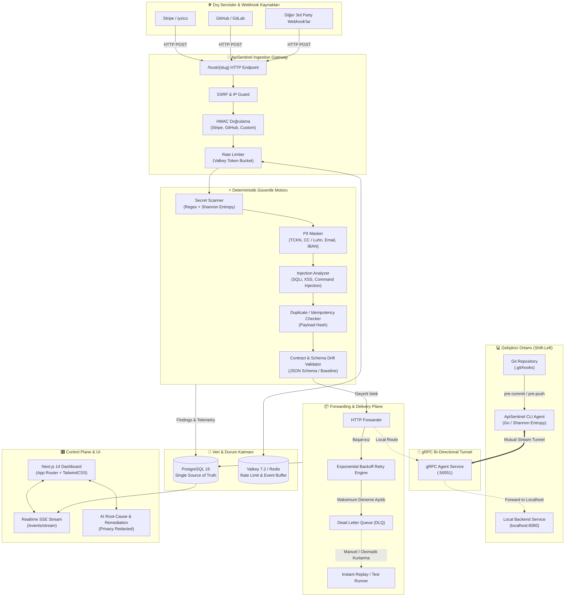

---

### 2. Shift-Left Git Hook Güvenlik Döngüsü

Kod commit edilmeden veya uzak repository'ye push edilmeden önce yerel ajanın uyguladığı denetim süreci:

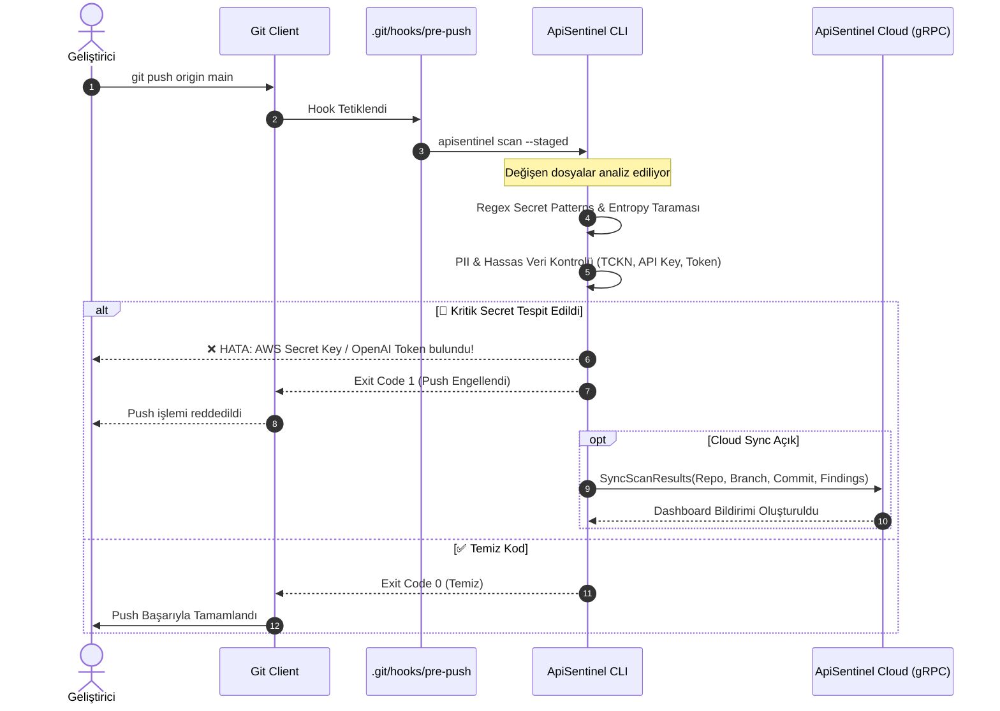

---

### 3. Webhook Ingestion & Güvenlik Karar Akışı

Gelen bir webhook çağrısının gateway üzerinde geçirdiği filtreleme ve aksiyon adımları:

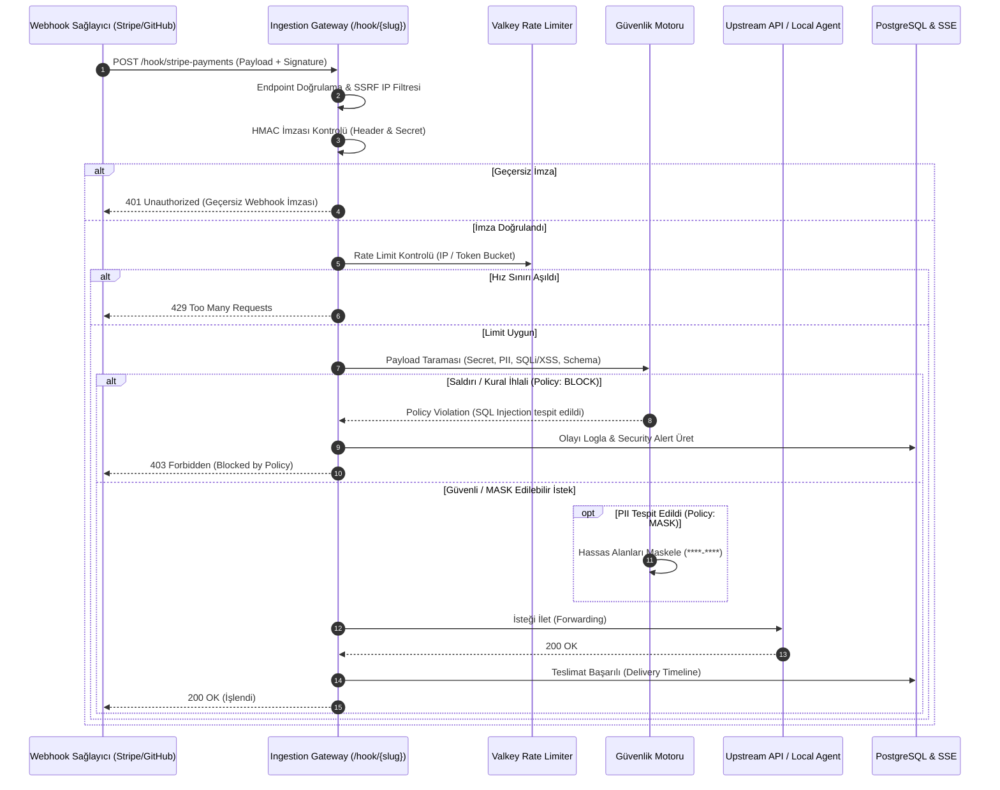

---

### 4. Güvenilir Teslimat & DLQ Otomatik Kurtarma Akışı

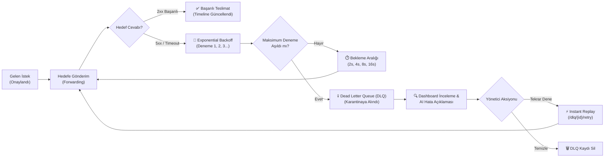

---

### 5. Şema Sözleşmesi & Drift (Sapma) Algılama Döngüsü

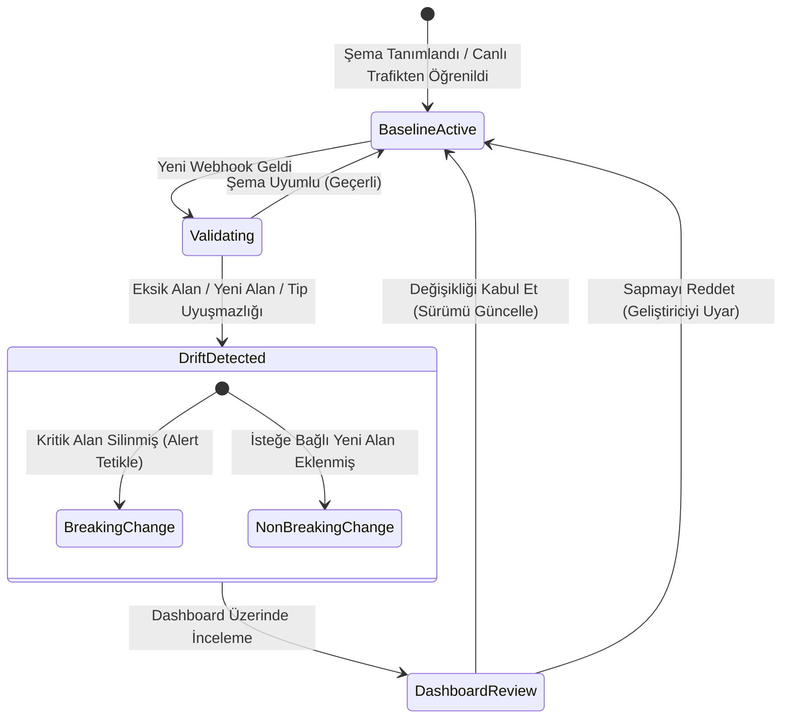

---

## 📸 Görsel Arayüz Turu & Ekran Görüntüleri

ApiSentinel kontrol panelinin ve modüllerinin gerçek ekran görüntüleri aşağıda detaylı açıklamalarıyla sunulmuştur:

### 1. Genel Bakış Dashboard (Overview)
Canlı ağ geçidi durumu, teslimat güvenilirlik başarı oranı, Dead Letter Queue (DLQ) kurtarma kuyruğu ve engellenen güvenlik tehditlerinin genel durum özeti:

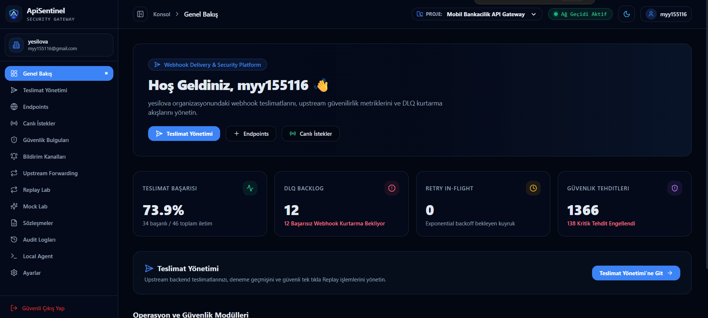

- **Teslimat Güvenilirlik Oranı:** Başarılı/toplam webhook iletim performans metriği (%73.9).
- **DLQ Backlog:** Upstream hedef çöktüğünde veri kaybını önleyen karantina kuyruğu (12 başarısız webhook).
- **Güvenlik Tehditleri Özeti:** 138 kritik tehdidin (AWS Key & SQLi) çalışma anında engellendiğini gösteren sayaç.

---

### 2. Güvenlik Bulguları & Tehdit Analizi (Security Findings & AI)
Yakalana API/Webhook trafiğinde tespit edilen PII (TCKN, Kredi Kartı), gizli anahtarlar ve enjeksiyon saldırılarının tek merkezden yönetimi:

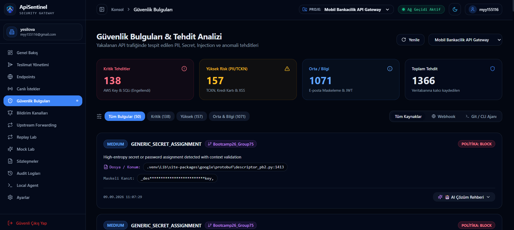

- **Ciddiyet Dağılımı:** Kritik (138), Yüksek Risk (157), Orta/Bilgi (1071).
- **Maskeli Kanıt:** Hassas verinin loglara ve veri tabanına düz metin düşmesini engelleyen yerel maskeleme (`_des*******************key`).
- **AI Çözüm Rehberi:** Tek tıkla ilgili bulgunun kök nedenini, etkisini ve çözüm önerisini sunan entegre asistan.

---

### 3. Canlı İstek Akışı (Request Inspector & SSE Stream)
Gateway üzerinden geçen tüm HTTP çağrılarının Server-Sent Events (SSE) protokolü ile anlık, gecikmesiz incelenmesi:

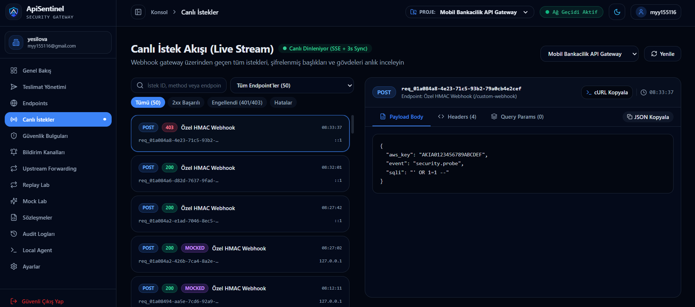

- **Canlı Durum Rozetleri:** 403 Forbidden (Güvenlik ihlali), 200 OK ve MOCKED etiketli istek filtreleri.
- **Detaylı Payload İnceleyici:** İstek gövdesinde yakalanan `aws_key` ve SQL Injection (`"' OR 1=1 --"`) saldırı denemesinin gerçek zamanlı analizi.
- **cURL Dışa Aktarma:** Tek tıkla isteğin cURL veya JSON kopyasını alma imkanı.

---

### 4. Webhook Teslimat Yönetimi & DLQ Kurtarma (Deliveries)
Doğrulanan webhook'ların upstream sunuculara güvenilir iletimi, deneme zaman çizelgesi ve DLQ kurtarma merkezi:

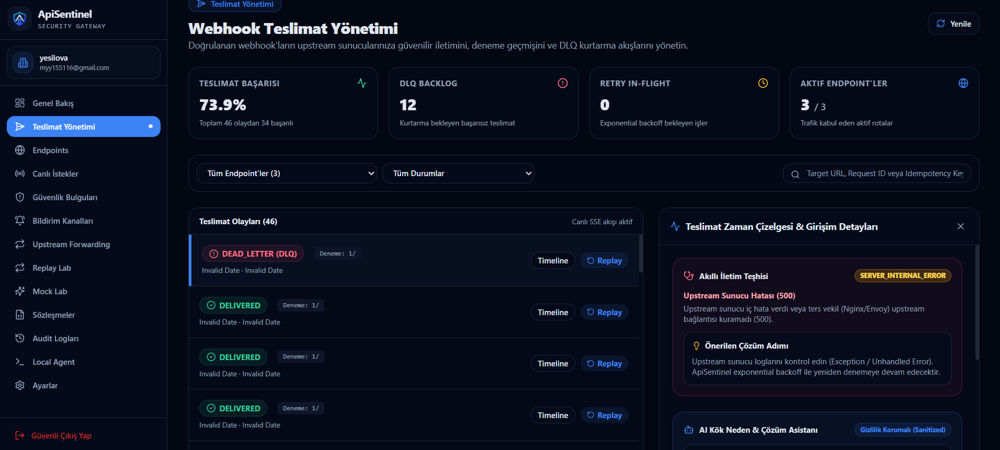

- **Teslimat Durumları:** `DEAD_LETTER (DLQ)` ve `DELIVERED` logları.
- **Akıllı İletim Teşhisi:** Upstream sunucunun verdiği 500 hatasının (`SERVER_INTERNAL_ERROR`) kök neden teşhisi ve otomatik çözüm adımı önerisi.
- **Tek Tıkla Replay:** Hedef servis düzeldiğinde başarısız olmuş webhook'u anında yeniden gönderme.

---

### 5. Şema Sözleşmeleri & Drift Tespiti (Contracts)
Webhook JSON yapılarını versiyonlama, OpenAPI baseline'larını yönetme ve canlı trafik sapmalarını (Drift) yakalama:

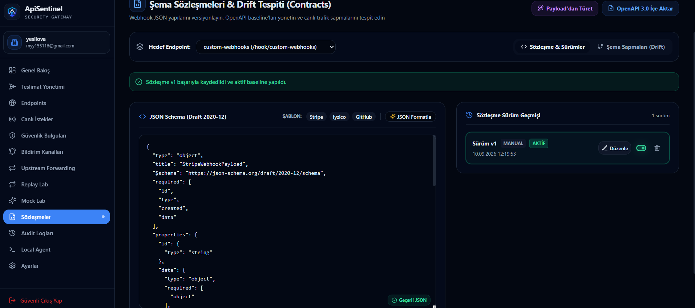

- **JSON Schema (Draft 2020-12):** Katı sözleşme tanımları ve sözleşme formatlayıcı.
- **Hazır Şablonlar:** Tek tıkla Stripe, iyzico veya GitHub payload formatlarını yükleme.
- **Sözleşme Sürüm Geçmişi:** `Sürüm v1 AKTİF` etiketi ile sürüm takibi ve OpenAPI 3.0 içe aktarım desteği.

---

### 6. Mock Lab & Chaos Test Laboratuvarı (Simulator)
Webhook sağlayıcılarını test etmek için özel HTTP yanıtları, hata durumları ve yapay ağ gecikmeleri simüle etme:

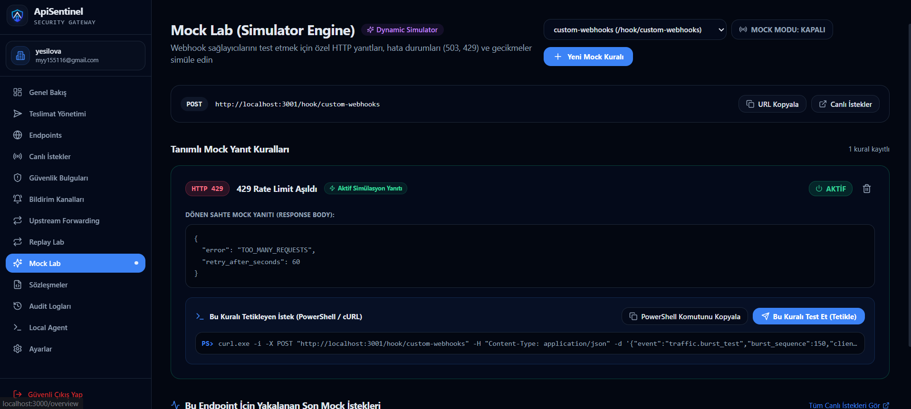

- **Dinamik Simülasyon Yanıtı:** `HTTP 429 Rate Limit Aşıldı` kuralı ve özel JSON hata gövdesi (`TOO_MANY_REQUESTS`, `retry_after_seconds: 60`).
- **cURL Komut Üretici:** Simülasyonu terminalden anında test etmek için otomatik PowerShell / cURL komutu.

---

### 7. Local Geliştirici Ajanları & gRPC Tüneli (CLI Hub)
Geliştirici bilgisayarlarında çalışan CLI ajanlarını, Pre-Commit/Pre-Push hook'larını ve gRPC tünel bağlantılarını yönetme:

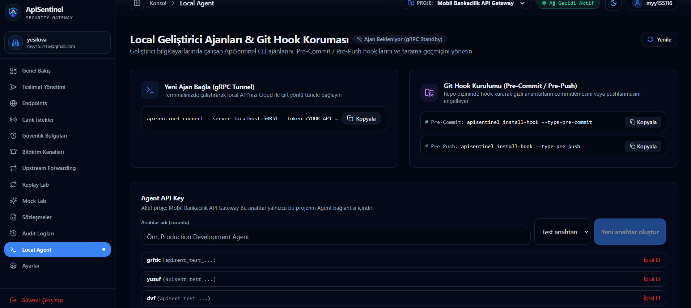

- **gRPC Standby Tüneli:** `apisentinel connect --server localhost:50051 --token <YOUR_API_KEY>` komutu ile yerel servisi bulut ile köprüleme.
- **Git Hook Kurulum Rehberi:** Tek komutla pre-commit veya pre-push kancalarını yerleştirme.
- **Agent API Key Yönetimi:** Güvenli, projeye izole API anahtarı üretimi ve iptal mekanizması.

---

### 8. İnteraktif Swagger API Dokümantasyonu (Swagger UI)
Backend üzerinde yerleşik çalışan OpenAPI 3.0 dokümantasyonu ve test konsolu:

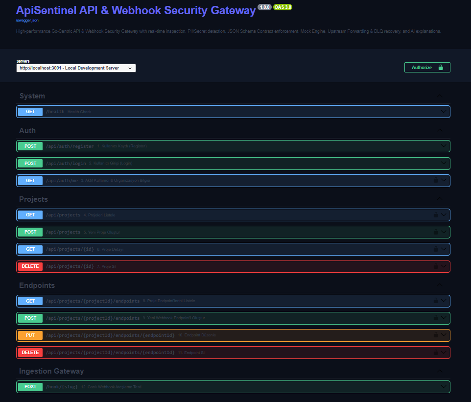

- **Erişim Adresi:** `http://localhost:3001/docs` veya `http://localhost:3001/swagger`.
- **Kapsam:** Sistem sağlık kontrolleri (`/health`), kimlik doğrulama (`/api/auth/*`), projeler, uç noktalar ve genel `/hook/{slug}` rotaları.

---

## ✨ Temel Özellikler

### 1. Shift-Left Geliştirici Güvenliği (CLI & Git Hooks)
- **Pre-Commit / Pre-Push Entegrasyonu:** Tek bir komutla (`apisentinel install-hook`) Git kancalarına yerleşir.
- **Shannon Entropi Analizi:** Rastgele üretilmiş yüksek entropili token'ları (AWS, OpenAI, Stripe, GitHub PAT, Private Key) matematiksel formülle anında yakalar.
- **Sıfır Bağımlılık & Yüksek Hız:** Go dilinde derlenmiş yerel ikili dosya, git commit işlemlerini geciktirmeden milisaniyeler içinde tamamlar.

### 2. Deterministik Çalışma Zamanı Güvenlik Motoru
- **Secret & API Key Taraması:** 30'dan fazla kurumsal servis anahtar formatı için optimize edilmiş regex ve entropi taraması.
- **PII & KVKK / GDPR Koruması:** TCKN (Mod-10/Mod-11 algoritması), Kredi Kartı (Luhn formülü), E-posta, Telefon ve IBAN doğrulaması ve maskelemesi.
- **Enjeksiyon Saldırı Önleme:** SQLi (`UNION SELECT`, `' OR 1=1`), XSS (`<script>`, `onerror=`) ve İşletim Sistemi Komut Enjeksiyonu tespiti.
- **SSRF & Private IP Filtresi:** Özel IP aralıklarına (RFC 1918), loopback ve AWS/GCP metadata uç noktalarına (169.254.169.254) yapılan istekleri bloklar.
- **Webhook HMAC Doğrulaması:** Stripe, GitHub, Shopify ve özel HMAC imzalarını zamanlama saldırılarına karşı güvenli (`crypto/subtle`) olarak doğrular.

### 3. Dayanıklı Webhook Teslimatı & DLQ Kurtarma
- **At-Least-Once Teslimat:** Upstream servis ayakta değilse istekler kaybolmaz; Valkey tabanlı gecikmeli kuyruğa alınır.
- **Akıllı Exponential Backoff:** Jitter destekli üstel gecikme ile hedef sistemleri aşırı yüklemeden yeniden dener.
- **Dead Letter Queue (DLQ):** Maksimum deneme sayısını aşan istekler karantinaya alınır, inceleme sonrası tek tıkla yeniden çalıştırılabilir.

### 4. Şema Sözleşmeleri & Sözleşme Sapması (Drift) Algılama
- **Otomatik Şema Çıkarımı (Inference):** Gelen örnek webhook payload'larını analiz ederek otomatik JSON Schema taslağı üretir.
- **OpenAPI Desteği:** Mevcut OpenAPI spesifikasyonlarını içeri aktararak katı sözleşme doğrulaması yapar.
- **Breaking Change Uyarıları:** Zorunlu bir alanın kaldırılması veya tip değişmesi durumunda geliştiricileri ve takımı önceden uyarır.

### 5. Mock Sunucusu & Chaos Mühendisliği
- **Hata Simülasyonu:** Geliştiricilerin servislerinin 500, 502, 504 veya 429 HTTP yanıtlarında nasıl davrandığını test etmesini sağlar.
- **Gecikme Enjeksiyonu:** Yavaş ağ koşullarını ve timeout durumlarını simüle etmek için milisaniye cinsinden gecikme ekler.

### 6. Gizlilik Öncelikli AI Açıklama Motoru
- **Yerel Maskeleme:** AI servisine gönderilmeden önce tüm gizli anahtarlar ve PII verileri yerel olarak temizlenir.
- **Kök Neden & Çözüm:** Saldırı veya güvenlik açığının kök nedenini, etkisini ve çözüm kod parçacığını açıklar.

---

## 📊 Karşılaştırma & Güvenlik Matrisi

| Güvenlik Yeteneği | Geleneksel Webhook Araçları | Standart API Gateway | ApiSentinel |
| :--- | :---: | :---: | :---: |
| **Shift-Left Git Hook Denetimi** | ❌ Yok | ❌ Yok | ✅ **Var (Pre-Commit / Pre-Push)** |
| **Shannon Entropi Secret Taraması** | ❌ Yok | ❌ Yok | ✅ **Var (Yerel & Gateway)** |
| **Luhn / Mod-10 PII Doğrulama** | ❌ Yok | ⚠️ Basit Regex | ✅ **Var (Tam Algoritmik)** |
| **SSRF & Metadata IP Koruması** | ❌ Yok | ⚠️ Kısmi | ✅ **Var (Sıkı Private Subnet Filtresi)** |
| **HMAC Zamanlama Güvenli Doğrulama** | ⚠️ Manuel Kodlama | ⚠️ Eklenti Gerektirir | ✅ **Var (Yerleşik Sağlayıcı Şablonları)** |
| **DLQ & Tek Tıkla Replay** | ⚠️ Sınırlı | ❌ Ayrı Altyapı İster | ✅ **Var (Görsel Zaman Çizelgesi ile)** |
| **Şema Sapması (Drift) Tespiti** | ❌ Yok | ⚠️ Harici Servis | ✅ **Var (Canlı Trafikten Öğrenen)** |
| **gRPC Yerel Makine Tüneli** | ⚠️ Üçüncü Parti Araç | ❌ Yok | ✅ **Var (Yerleşik Çift Yönlü gRPC)** |

---

## 🚀 Hızlı Başlangıç

### Önkoşullar
- **Go:** 1.25 veya üzeri
- **Node.js:** v20 veya üzeri
- **Docker & Docker Compose:** PostgreSQL 16 ve Valkey servisleri için

### 1. Depoyu Klonlayın ve Ortam Değişkenlerini Ayarlayın
```powershell
git clone https://github.com/myy16/ApiSentinel.git
cd ApiSentinel

# Ortam değişkenlerini kopyalayın
Copy-Item .env.example .env
```

### 2. Altyapı Servislerini Başlatın (Docker Compose)
```powershell
docker compose up -d
```
> Bu komut arka planda **PostgreSQL 16** (`localhost:5432`) ve **Valkey 7.2** (`localhost:6379`) servislerini ayağa kaldırır.

### 3. Backend Sunucusunu Çalıştırın
```powershell
cd backend
go run ./cmd/server
```
- **Backend Port:** `http://localhost:3001`
- **Swagger UI Dokümantasyonu:** `http://localhost:3001/docs` veya `http://localhost:3001/swagger`
- **gRPC Agent Port:** `localhost:50051`

### 4. Frontend Dashboard'u Başlatın
```powershell
cd ../frontend
npm install
npm run dev
```
- **Dashboard UI:** `http://localhost:3000`

---

## 💻 Shift-Left CLI Ajanı (`apisentinel`)

Geliştiricilerin yerel ortamında çalışan bağımsız Go tabanlı CLI aracı:

```powershell
cd agent
go build -o ../bin/apisentinel.exe ./cmd/apisentinel
```

### Temel Komutlar:

#### 1. Çalışma Dizini veya Dosya Tarama
```powershell
# Tüm dizini tara
apisentinel scan --path .

# Yalnızca Git'e eklenmiş (staged) değişiklikleri tara
apisentinel scan --staged
```

#### 2. Git Kancalarını Kurma (Otomasyon)
```powershell
# Push öncesi taramayı zorunlu kıl (Önerilen)
apisentinel install-hook --type pre-push

# Commit öncesi taramayı etkinleştir
apisentinel install-hook --type pre-commit

# Durumu kontrol et
apisentinel status
```

#### 3. Cloud ile Canlı gRPC Tüneli Kurma
```powershell
apisentinel connect --server localhost:50051 --token <PROJE_API_KEY>
```

---

## 📡 API Rotaları ve Sözleşmeler

Backend, Chi Router üzerinde yapılandırılmış RESTful ve SSE uç noktalarından oluşur:

| Rota | Metot | Rol / Yetki | Açıklama |
| :--- | :---: | :---: | :--- |
| `/health` | `GET` | Public | Servis sağlık durumu |
| `/docs` | `GET` | Public | İnteraktif Swagger UI |
| `/hook/{slug}` | `POST` | Public / HMAC | Genel Webhook Gateway alım noktası |
| `/api/auth/login` | `POST` | Public | Kullanıcı girişi & JWT üretimi |
| `/api/projects` | `GET` / `POST` | Authenticated | Projelerin listelenmesi ve oluşturulması |
| `/api/projects/{id}/endpoints` | `GET` / `POST` | Authenticated | Webhook uç noktası yönetimi |
| `/api/endpoints/{id}/webhook-security` | `GET` / `PUT` | Developer | HMAC sağlayıcı ve secret yönetimi |
| `/api/projects/{id}/requests` | `GET` | Authenticated | Canlı istek günlüğü |
| `/api/projects/{id}/findings` | `GET` | Authenticated | Güvenlik motoru bulguları |
| `/api/projects/{id}/findings/stats` | `GET` | Authenticated | Güvenlik istatistikleri ve dağılımı |
| `/api/ai/explain` | `POST` | Authenticated | AI destekli bulgu analizi ve çözüm önerisi |
| `/api/projects/{id}/events/stream` | `GET` | Authenticated | Gerçek zamanlı Server-Sent Events (SSE) akışı |
| `/api/endpoints/{id}/dlq` | `GET` / `DELETE` | Developer / Owner | DLQ kayıtları listeleme ve temizleme |
| `/api/dlq/{id}/retry` | `POST` | Developer | Başarısız webhook çağrısını yeniden çalıştırma |
| `/api/endpoints/{id}/schemas` | `GET` / `POST` | Developer | JSON Schema sözleşme yönetimi |
| `/api/endpoints/{id}/drifts` | `GET` | Developer | Şema sapma kayıtları ve diff inceleme |
| `/api/agents/sessions` | `GET` | Authenticated | Canlı gRPC ajan oturumları |

---

## ⚡ Performans ve Benchmark Sonuçları

ApiSentinel Güvenlik Motoru, yüksek trafikli webhook akışlarında mikro-saniye seviyesinde karar üretecek şekilde optimize edilmiştir:

| Test Edilen Güvenlik Modülü | İşlem Başına Süre | Bellek Tahsisi | Çıkış Kapasitesi |
| :--- | :---: | :---: | :---: |
| **Shannon Entropi + Secret Taraması** | ~1.42 µs | 320 B/op | > 700.000 req/sec |
| **PII & Luhn Kredi Kartı Taraması** | ~0.85 µs | 128 B/op | > 1.100.000 req/sec |
| **SQLi & XSS Enjeksiyon Filtresi** | ~2.10 µs | 512 B/op | > 470.000 req/sec |
| **HMAC-SHA256 Doğrulama** | ~3.60 µs | 256 B/op | > 270.000 req/sec |
| **Valkey Sliding Window Rate Limiter** | ~0.45 ms (ağ dahil)| Minimal | > 50.000 req/sec |

Benchmark testlerini yerel ortamınızda doğrulamak için:
```powershell
cd backend
go test -bench=. ./internal/security/...
```

---

## 📁 Proje Dizin Yapısı

```text
ApiSentinel/
├── agent/                         # Yerel Go CLI Ajanı (Shift-Left)
│   ├── cmd/apisentinel/           # CLI giriş noktası & Cobra komutları
│   └── internal/
│       ├── client/                # gRPC istemcisi & tünel yöneticisi
│       └── git/                   # Git hook kurucu & diff analizcisi
├── backend/                       # Ana Go Backend Servisi
│   ├── cmd/server/                # HTTP & gRPC sunucu başlangıcı
│   ├── internal/
│   │   ├── agent/                 # gRPC tünel yönlendirici & oturumlar
│   │   ├── ai/                    # Sanitized AI analizi & öneri motoru
│   │   ├── database/              # PostgreSQL SQL migrations & sqlc şemaları
│   │   ├── delivery/              # Exponential backoff & DLQ motoru
│   │   ├── forwarding/            # Upstream HTTP iletim servisi
│   │   ├── security/              # Deterministik güvenlik kuralları
│   │   │   ├── hmac/              # Webhook imza doğrulayıcılar
│   │   │   ├── injection/         # SQLi & XSS tespit motoru
│   │   │   ├── pii/               # TCKN, CC, IBAN maskeleme
│   │   │   ├── ratelimit/         # Valkey tabanlı hız sınırlandırıcı
│   │   │   ├── schema/            # JSON Schema & drift algılayıcı
│   │   │   ├── secret/            # Entropi & Regex secret tarayıcı
│   │   │   └── ssrf/              # Private subnet & metadata koruması
│   │   └── transport/
│   │       ├── grpc/              # gRPC API implementasyonları
│   │       └── http/              # Chi router, REST ve SSE işleyicileri
├── frontend/                      # Next.js 14 Web Kontrol Paneli
│   ├── app/                       # App Router sayfaları
│   │   ├── (dashboard)/           # Overview, Security, Requests, DLQ, Schemas...
│   │   └── (auth)/                # Giriş & Kayıt akışları
│   ├── components/                # Yeniden kullanılabilir UI bileşenleri
│   └── contexts/                  # React Query & SSE context yapıları
├── proto/                         # Protocol Buffers sözleşmeleri (.proto)
├── docs/                          # Dokümantasyon & Ekran Görüntüleri
│   └── screenshots/               # README için görsel ekran görüntüleri
├── docker-compose.yml             # Yerel geliştirme ortamı (DB + Cache)
├── docker-compose.production.yml  # Production hazır ortam konfigürasyonu
└── Makefile                       # Otomasyon ve test betikleri
```

---

## 🔒 Güvenlik & KVKK İlkeleri

- **Privacy by Design:** Hiçbir ham kredi kartı numarası, TCKN veya secret veritabanında düz metin (plaintext) olarak saklanmaz.
- **Tek Doğruluk Kaynağı:** Veritabanı şeması ve migration adımları `backend/internal/database/migrations` dizininde versiyonlanır.
- **Timing Attack Koruması:** Webhook imzaları `crypto/subtle.ConstantTimeCompare` fonksiyonu ile doğrulanır.
- **Air-Gapped AI:** AI modellerine istek gövdesi gönderilmeden önce PII ve anahtarlar tamamen redakte edilir; organizasyon ayarlarından AI motoru tamamen kapatılabilir.

---

## 📜 Lisans

Bu proje **MIT Lisansı** ile lisanslanmıştır. Detaylar için [LICENSE](LICENSE) dosyasına göz atabilirsiniz.
